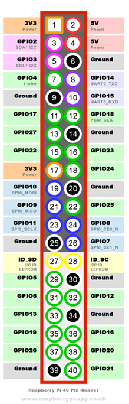

# Raspberry GPIO Header
>Version 1.0  
>Date: Fall 2025
---
## 40-pin GPIO Header

The **40 Pin GPIO Header** is a critical feature in the **Raspberry Pi** Single Board Computer that enables flexible pin usage. The header has pins that can serve various purposes depending on how the pin are configured. These pins can function as **GPIOs (General Purpose Input/Output)**, or be assigned to other peripheral functions like **UART**, **SPI**, **I2C**, **PWM**, and more.

   
  <em>Figure 1: Raspberry Pi 5 – 40-pin GPIO Header</em>

## Pin Control Tool
The **pinctrl** is a Command Line Interface (CLI) tool that allows you to monitor and configure the GPIO pins for different functions, giving you the ability to reuse physical pins for different roles in different applications. This flexibility is particularly useful when debugging your projects. 

For additional information on to use **pinctrl help** to see how to use it.

   

## Contact Information
Bruce Link  
Monroe Community College  
Information & Computer Technologies Department  
blink@monroecc.edu

